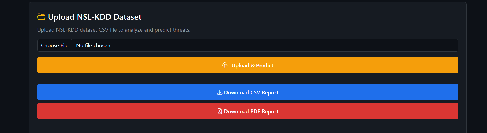
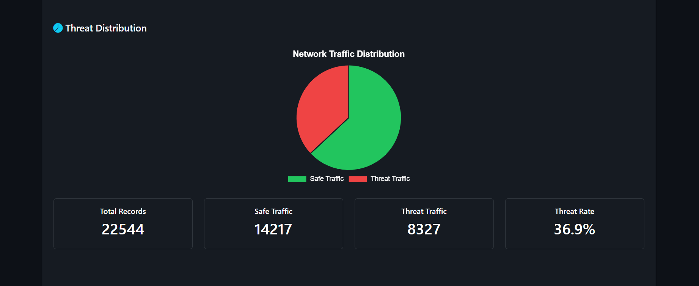
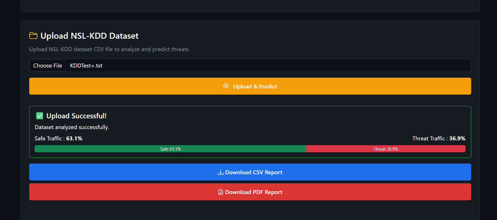

# 🛡️ AI Cyber Threat Detection System

<p align="center">
  
  
  
  
  
</p>

---

## 📌 Overview

AI Cyber Threat Detection System is a Machine Learning-powered web application that detects malicious network traffic using the **NSL-KDD Dataset** and a **Random Forest Classifier**.

The application provides:

- 🔍 Real-time network traffic prediction
- 📂 Batch prediction using uploaded datasets
- 📊 Live analytics dashboard
- 🤖 AI-generated cybersecurity analysis using Groq LLM
- 📄 PDF report generation
- 📥 CSV report download
- 🌐 Deployed on Render

---

## 🌐 Live Demo

👉 **Live Website**

https://ai-cyber-threat-detection-h0vl.onrender.com

---

## 💻 GitHub Repository

https://github.com/adoresanjali/AI-Cyber-Threat-Detection

---

# ✨ Features

- ✅ Random Forest Intrusion Detection Model
- ✅ Upload NSL-KDD Dataset
- ✅ Single Network Traffic Prediction
- ✅ Live Threat Analytics
- ✅ AI Threat Analysis (Groq LLM)
- ✅ Threat Distribution Dashboard
- ✅ Detection History
- ✅ PDF Report Download
- ✅ CSV Report Download
- ✅ Responsive UI
- ✅ Fully Deployed on Render

---

# 🖥️ Screenshots

## Dashboard


---

## Upload & Prediction



---

## Analytics Dashboard



---

## AI Threat Analysis


---

## PDF Report



---

# ⚙️ Tech Stack

## Frontend

-HTML5 – Provides the basic structure and layout of the web application.

CSS3 – Used for custom styling, responsive layouts, colors, spacing, and visual design.

Bootstrap 5 – Provides responsive UI components, grid layouts, cards, buttons, and forms.

JavaScript – Handles API communication, predictions, dashboard updates, analytics, and user interactions.

Backend

Flask – Powers the backend server, API endpoints, prediction logic, file uploads, and report generation.

Flask-CORS – Enables secure communication between the frontend and Flask backend through cross-origin API requests.

Machine Learning

Random Forest – Main classification algorithm used to detect whether network traffic is normal or malicious.

Scikit-learn – Provides the Machine Learning tools for model training, preprocessing, scaling, prediction, and evaluation.

Pandas – Used for loading, cleaning, processing, and analyzing the NSL-KDD dataset and uploaded CSV files.

NumPy – Supports numerical computations and array-based operations in the Machine Learning pipeline.

AI

Groq API – Provides access to the Llama model for AI-powered cybersecurity threat analysis.

Llama Model – Analyzes ML detection results and generates threat severity, possible attack type, risk assessment, and security recommendations.

Deployment

Render – Used to deploy and host the Flask-based application as a publicly accessible web application.
---

# 📂 Project Structure

```text
AI-Cyber-Threat-Detection
│
├── assets/
├── dataset/
├── model/
│   ├── model.pkl
│   ├── scaler.pkl
│   └── label_encoders.pkl
│
├── static/
│   ├── css/
│   └── js/
│
├── templates/
│   └── index.html
│
├── utils/
│
├── app.py
├── requirements.txt
├── train_model.py
└── README.md
```

---

# 🧠 Machine Learning Workflow

```
NSL-KDD Dataset
        │
        ▼
Data Preprocessing
        │
        ▼
Label Encoding
        │
        ▼
Feature Scaling
        │
        ▼
Random Forest Model
        │
        ▼
Prediction
        │
        ▼
Threat Analytics
        │
        ▼
Groq AI Analysis
        │
        ▼
Dashboard + PDF Report
```

---

# 🚀 Installation
Clone the Repository

git clone https://github.com/adoresanjali/AI-Cyber-Threat-Detection.git
cd AI-Cyber-Threat-Detection


Move into the project

```bash
cd AI-Cyber-Threat-Detection
```

Create virtual environment

```bash
python -m venv venv
```

Activate virtual environment

### Windows

```bash
venv\Scripts\activate
```

Install dependencies

```bash
pip install -r requirements.txt
```

Create a `.env` file

```env
GROQ_API_KEY=YOUR_GROQ_API_KEY
```

Run the application

```bash
python app.py
```

---

# 📊 Model Performance

| Metric | Score |
|---------|-------|
| Accuracy | **99.1%** |
| Precision | **98.8%** |
| Recall | **99.2%** |
| F1 Score | **99.0%** |

---

# 📈 Dataset

Dataset Used:

**NSL-KDD**

Files:

- KDDTrain+.txt
- KDDTest+.txt

---

# 📄 Reports

The system generates:

- PDF Threat Report
- CSV Threat Report

---
**🎓 Key Learnings**

-Through this project, I gained practical experience in:

-Machine Learning and Random Forest classification

-Data preprocessing and feature scaling

-Flask backend and REST API development

-Frontend and dashboard development

-Generative AI and prompt engineering

-Groq/Llama API integration

-Cybersecurity and intrusion detection

-Error handling and fallback mechanisms

-Git/GitHub and cloud deployment

💡 Biggest Learning

-Building an AI application is not just about training a model.

-I learned how to transform a Machine Learning model into a complete application:

Data
 ↓
ML Model
 ↓
Backend API
 ↓
Web Dashboard
 ↓
AI Analysis
 ↓
Reports
 ↓
Deployment

⚠️ Limitations

The model is trained on the NSL-KDD dataset.

The current system does not capture live network packets.

The ML model primarily performs binary Safe/Threat classification.

AI analysis depends on the Groq API, although fallback logic is available.

The project is intended as an educational/portfolio implementation rather than a production IDS.

---

# 🔮 Future Enhancements

- 🔹 Live Network Packet Capture
- 🔹 Real-time IDS Integration
- 🔹 SIEM Dashboard
- 🔹 Threat Heatmaps
- 🔹 User Authentication
- 🔹 Database Integration
- 🔹 Email Alerts
- 🔹 Docker Deployment
- 🔹 Kubernetes Support

---

# 👨‍💻 Developer

**Anjali Sharma**

CSE-AI&ML

GitHub

https://github.com/adoresanjali

LinkedIn

https://www.linkedin.com/in/anjali-831492344/

---

# ⭐ Support

If you like this project, consider giving it a ⭐ on GitHub.

It motivates me to build more AI and Cybersecurity projects.

---

# 📜 License

This project is licensed under the MIT License.
